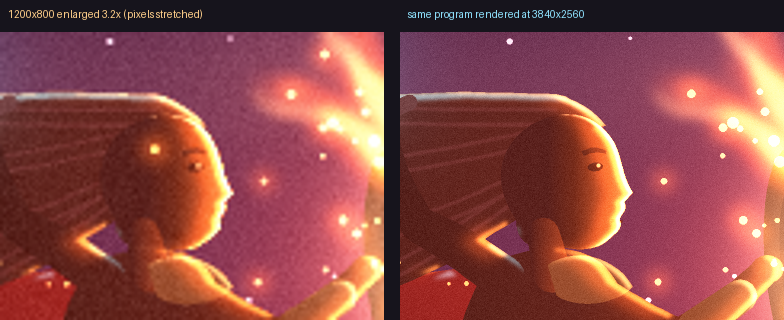

# KOSIF Studio: drawing pixel by pixel (skill 109 guide)

Everything below runs from this skill's `scripts/` folder: `cd scripts` first.

KOSIF Studio is a desktop drawing program. You give it a picture as **code from any AI** or as **an image**, and it
draws that picture in front of you one pixel at a time, in the order a painter would: brush strokes for the sky,
shapes growing outward from their centre, figures rising from their feet, sparks scattered last.



## Three ways to give it a picture

| | How | What it becomes |
|---|---|---|
| **📝 Code from any AI** | Press "📝 كود", paste, press "ارسم الكود" (or Ctrl+V straight onto the window) | SVG and KOSIF scenes stay vector. PIL, matplotlib and turtle produce raster pictures |
| **🖼 An image** | Press "🖼 صورة", or Ctrl+V on a copied picture | **"مطابق تماماً"** (the default): painted from nothing and ending **identical to the original, pixel for pixel**. "متجه قابل للتكبير": traced into vector shapes |
| **📂 A scene** | The scene list (`scenes/`) | Hand-written vector pictures, plus everything you saved |

The kinds of code it accepts:

- **SVG.** Every AI writes it well. It is drawn element by element and exports at any size without losing quality.
- **Python with PIL.** Every drawing command is recorded, so the picture is drawn **in the order the code draws
  it**. Consecutive commands of the same kind are grouped, so 360 sky lines become 18 brush strokes.
- **matplotlib / turtle.** The finished picture is drawn in brush strokes.
- **All Python code** (PIL, matplotlib, turtle) is drawn at the **picture's own size, without resampling**, and
  ends identical to what the code itself produces. The studio checks this at the end.

## 📤 Image code: a Python program that makes the image again

Press **"📤 كود الصورة"** (or `python studio.py --image-code photo.jpg`) and you get a **standalone Python
program** (Pillow only). `python name.py` anywhere writes `name.png`, **identical to the original**, and the
program checks that itself. It has two parts: the picture's colour regions as `draw.polygon(...)` calls, largest
first, readable and editable; then the original's own bytes, from which every pixel the drawing did not get
exactly right is completed. Verified on a 900×900 ad (3,394 polygons, 0 differing pixels) and on a logo.
Opened in the studio, the program's own polygons are drawn in the code's order and then the details.
`--data-only` gives the older pure-data form, which the studio reads without running anything.

## Realism: primitives, a guide and a measured gate

`render.py` now has `shade` (form shading toward a light), `noise` (fractal texture: skin, rock, water, clouds)
and `scales`. `references/drawing-guide.md` is the agent's guide: which code to write for which input, the full
scene language, the realism recipe (three lights, shade + noise + rim on every large shape, atmospheric depth,
grade/vignette/grain) and the review loop. `judge.py` measures a render (flat fills, one-pixel edges, distinct
colours, tonal range) against thresholds calibrated on real photographs, shaded scenes and flat cartoons, then
asks Jev which description fits the numbers. `scenes/whale_dragon.py` was built with it: three rounds, PASS.

### The older pure-data image code

Code written from a description, by any AI or by hand, is a redrawing. It can come close to a photo but never
match it. For an identical result, press **"📤 كود الصورة"** (or run `python studio.py --image-code photo.jpg`).

You get a self-contained code file with **the original image's own bytes embedded**. Pasted or opened in any
KOSIF Studio, it is drawn from a blank sheet pixel by pixel. For photos Jev chooses the plan, and the drawing
ends **identical to the original**, checked at the end. Verified on a 900×900 ad: **0 differing pixels** from the
original JPEG, in 30 steps.

The code is read as data only (`ast.literal_eval`). Nothing in it is executed, so a command inside it cannot run.

## Exact match with the original ("مطابق تماماً")

The image is painted from a blank, transparent sheet the way a painter works, in three stages:

1. **Blocking in.** The large shapes go down in a few flat colours: the logo's own colours, or a photo's 12 main tones.
2. **Refining.** For photos, 64 tones are added: shadows, then mid-tones, then lights.
3. **Final touches.** Every pixel that still differs gets its exact original value, including transparency.

At the end the studio compares the result with the original, pixel by pixel. It then shows
**"✅ مطابقة للأصل 100%: N من N بيكسل"** and saves `out/<name>_exact.png`. That file is identical to the original
in every pixel (verified on a logo and on 1254×1254 photos: 0 differing pixels).

### Jev chooses the painting plan (photos)

A photo has no colours of its own the way a logo does, so the studio measures four plans on a reduced copy, in
about 3 s. The plans block in with 6, 10, 16 or 24 colours, then refine with 32 to 128 tones. For each plan it
measures how close the first impression is, how close refining gets, and how many pixels are still visibly off
before the final touches. It then asks **Jev** which plan paints most like an artist with the least visible
correction left. Jev is asked twice in parallel with the options in reverse order, and the two answers are
averaged.

On the 1254×1254 ad, Jev chose 24 colours then 128 tones with **89% confidence**, consistent in both orders.
Before the final touches, only 0.8% of pixels were still visibly off. The plain rule would have chosen 10
colours (3.4% visibly off). Jev's choice and its confidence appear in the window's top line. If Jev is
unreachable, the rule decides and the result is still identical.

The final touches go from most visible to least. Visible details get proper time, fine corrections less, and
differences the eye cannot see (ΔE under 4) almost none, but they are still drawn so that the final match is
exact.

Drawing happens at the image's own resolution and is shown fitted to the window. "تصدير عالي الدقة" for an image
produces the vector version (SVG + 3840×2560) for enlarging, with simplified colours. The exact version is the
original at its own size.
- **A KOSIF scene.** A `build()` function returns `Step`s, with lighting effects such as glow, rim light and soft
  gradients. This is the cinematic quality of the dragon scene.

### Getting code from any AI

Press **"🤖 انسخ تعليمات للذكاء الاصطناعي"** in the code panel. It copies a ready prompt. Paste it into ChatGPT,
Gemini, Claude or any other AI, write your picture's description in the brackets, then paste the code it gives
you back into the panel. The panel strips the ``` fences AIs wrap around code.

### Safety

Pasted code runs **on your computer with your permissions**. It runs in a separate process with a 120-second
limit, and in a scratch folder so the files it writes don't land next to the program. Before running, the studio
scans the code. If it finds commands beyond drawing (deleting files, running programs, internet access, low-level
system access), it shows them and asks you. SVG is data, so it is never checked.

## Running it

```bash
python studio.py                         # the studio with the dragon scene
```

```bash
python studio.py --code drawing.py       # draw a code file (SVG / PIL / matplotlib / turtle / scene)
```

```bash
python studio.py --image photo.jpg       # trace an image and redraw it
```

```bash
python studio.py dragon_girl --render out/x.png --scale 3.2   # no window: 3840x2560
```

```bash
python -m unittest discover -s tests     # 25 tests
```

Requirements: Python 3.11+, Pillow, numpy, opencv-python, arabic-reshaper, python-bidi. matplotlib is needed only
for matplotlib code.

## Files

| File | Role |
|---|---|
| `studio.py` | The window: drawing, the code panel, images, saving and exporting |
| `render.py` | The vector renderer: shapes (the full SVG path language, holes, strokes), gradients (including see-through), light (`glow`, `rim`), text (shaped Arabic), finishing, and the painter's drawing order |
| `svg_import.py` | SVG → steps (shapes, transforms, CSS, gradients, text) |
| `runner.py` | Runs code from any AI in its own process and records PIL commands in order |
| `exact.py` | Exact redraw: blocking in → refining → final touches, ending identical to the original. For photos, the plan is chosen by Jev |
| `to_python.py` | Image → standalone Pillow program (polygons + embedded original), identical output |
| `judge.py` | Realism gate: measured flat fills, hard edges, colours, tonal range; calibrated thresholds; Jev reads the numbers |
| `references/drawing-guide.md` | The agent's guide: prompt or image → code, scene language, realism recipe, review loop |
| `jev_client.py` | Jev, the fast judge: asks twice in parallel with the options reversed and averages the answers. If Jev is unreachable, a deterministic rule decides |
| `vectorize.py` | Image → vector colour layers (+ SVG). Logos: true colours with exact edges. Photos: 24 colours |
| `vector_scene.py` | Builds the drawing steps from a traced image |
| `scenes/` | `dragon_girl.py`, `duck_dragon.py`, `whale_dragon.py` (realism showcase, built with judge.py). Traced images and saved code land here too |
| `examples/` | AI-style examples: a PIL house, an SVG rocket, a matplotlib flower, and code with a deliberate error |

## Measured on this machine

| | |
|---|---|
| Girl-versus-dragon scene | 22 steps, drawn live in **15.3 s** (4.97 million pixels) |
| Logo in exact mode | 11 steps, drawn in **6.3 s**, **0 differing pixels** |
| Ad image (1254×1254) in exact mode | 18 steps, **0 differing pixels** |
| Ad image in vector mode | traced in 6.8 s, drawn in **10 s** (24 colours, 26 steps) |
| AI PIL code (the house) | 25 steps in the code's own order, 6–15 s to process |
| Rendering a scene at 1200×800 / 3840×2560 | 4.4 s / 40–57 s |

## Honest limits

- **Exact and enlargeable at once is impossible for an image.** The exact version is the original at its own
  resolution (a raster). The enlargeable version is vector with simplified colours. The studio gives you both.
- **Pictures from PIL, matplotlib and turtle are raster.** They match the code's own output exactly at its size,
  but cannot be enlarged without loss. SVG, KOSIF scenes and traced images enlarge without limit.
- **Tracing is only as detailed as its source.** A 155-pixel logo's fine lines and small text
  come out approximate. A high-resolution original, or the designer's file, traces perfectly.
- **In vector mode, photos become a poster in 24 colours** (use exact mode for an identical copy).
- **SVG features not drawn:** filters, masks, clip paths, patterns, embedded images. Their shapes are drawn without
  the effect.
- **Turtle is captured from its window** at the end, so the window appears briefly.

## Adding a scene by hand

```python
TITLE = "My scene"

def build():                     # everything in render.py is available without import
    return [
        Step("Sky", [fill(rect(0, 0, 1200, 800), lin((0, 0), (0, 800), [(0, "#0a0a2a"), (1, "#3a1a3a")]))], "sweep"),
        Step("Moon", [fill(ellipse(900, 200, 90), "#fff3d0"), glow(ellipse(900, 200, 90), "#8a7ad0", 40, .5)],
             "grow", origin=(900, 200)),
        Step("Title", [text("ليلة هادئة", 600, 700, 64, "#ffffff", anchor="mm", bold=True)], "sweep"),
    ]
```

The sheet is 1200×800. Drawing orders are `sweep`, `grow`, `rise`, `down`, `left`, `right` and `sparkle`.
